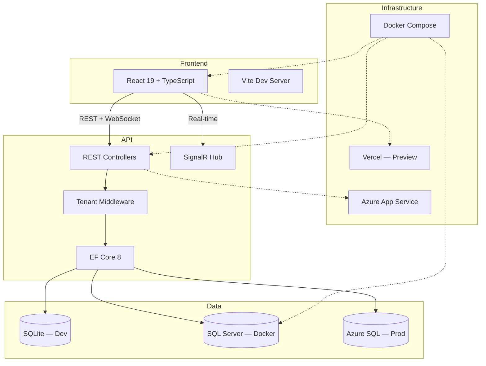

# LogisticsInventorySystem

[](https://github.com/PohTeyToe/LogisticsInventorySystem/actions/workflows/azure-deploy.yml)
[](https://github.com/PohTeyToe/LogisticsInventorySystem/actions/workflows/frontend-ci.yml)
[](https://github.com/PohTeyToe/LogisticsInventorySystem/actions/workflows/codeql.yml)
[](LICENSE)

A multi-tenant logistics and inventory management platform built with ASP.NET Core and React. Tracks warehouses, inventory, suppliers, purchase orders, and stock movements with real-time updates via SignalR.

### Live Demo

| Service | URL |
|-|-|
| API (Swagger) | [logistics-inventory-api-abdallah.azurewebsites.net/swagger](https://logistics-inventory-api-abdallah.azurewebsites.net/swagger) |
| Health Check | [logistics-inventory-api-abdallah.azurewebsites.net/api/health](https://logistics-inventory-api-abdallah.azurewebsites.net/api/health) |
| Frontend | Preview URLs generated per PR via Vercel |

> All API endpoints require an `X-Tenant-Id` header (default: `1`). Use the Swagger UI to explore and test endpoints interactively.

## Architecture



## Features

- **Multi-tenant isolation** — all data scoped by tenant ID via EF Core global query filters
- **Real-time inventory updates** — SignalR pushes stock changes to connected dashboard clients
- **Purchase order pipeline** — full lifecycle workflow: Pending → Approved → Shipped → Received
- **Warehouse management** — multiple warehouses with capacity tracking and utilization metrics
- **Stock movements** — track IN/OUT/ADJUSTMENT operations with complete audit trail
- **CSV bulk import** — upload inventory data with row-level validation and error reporting
- **Analytics dashboard** — ABC analysis, movement trends, top movers, sparkline KPIs
- **Reports** — inventory valuation by category/warehouse, low-stock alerts, PDF/CSV export
- **JWT authentication** — register, login, token refresh with protected routes
- **Command palette** — Ctrl+K quick navigation across the entire application
- **Rate limiting** — 100 requests/minute fixed-window policy on all API endpoints
- **Docker-ready** — single `docker compose up` for SQL Server, API, and frontend

## Tech Stack

| Layer | Technology |
|-|-|
| Frontend | React 19, TypeScript 5.9, Vite 7, TanStack Query, Recharts, CSS Modules |
| Backend | ASP.NET Core 8.0, Entity Framework Core, SignalR, Serilog |
| Database | SQLite (dev), SQL Server 2022 (Docker), Azure SQL (prod) |
| Testing | xUnit (68 tests), Vitest + RTL (69 tests), Playwright E2E |
| CI/CD | GitHub Actions, Azure App Service, Vercel preview deploys |
| Tooling | Docker Compose, Makefile, Dependabot, CodeQL, Claude AI review |

## Getting Started

### Prerequisites

- [.NET 8 SDK](https://dotnet.microsoft.com/download/dotnet/8.0)
- [Node.js 20+](https://nodejs.org/)
- [Docker](https://www.docker.com/) (optional, for containerized dev)

### Run with Docker

```bash
git clone https://github.com/PohTeyToe/LogisticsInventorySystem.git
cd LogisticsInventorySystem
docker compose up -d
```

| Service | URL |
|-|-|
| Frontend | http://localhost:3000 |
| API | http://localhost:7001 |
| SQL Server | localhost:1433 |

### Run Locally

```bash
git clone https://github.com/PohTeyToe/LogisticsInventorySystem.git
cd LogisticsInventorySystem

# Install frontend dependencies
cd src/logistics-dashboard && npm install && cd ../..

# Start both API and frontend with hot reload
make dev
```

The API starts on `https://localhost:7001` (SQLite, no database setup needed) and the React dashboard on `http://localhost:5173`.

### Verify

```bash
make test       # All tests (API + frontend)
make build      # Production build
make lint       # Lint frontend
```

## API Endpoints

All endpoints require the `X-Tenant-Id` header. Responses use PascalCase JSON. Full interactive docs at [`/swagger`](https://logistics-inventory-api-abdallah.azurewebsites.net/swagger).

| Resource | Base Path | Operations |
|-|-|-|
| Auth | `/api/Auth` | Register, login, token refresh |
| Inventory | `/api/Inventory` | CRUD, search, low-stock alerts |
| Categories | `/api/Category` | CRUD |
| Warehouses | `/api/Warehouse` | CRUD, utilization metrics |
| Suppliers | `/api/Supplier` | CRUD, performance metrics |
| Purchase Orders | `/api/PurchaseOrder` | CRUD, status workflow |
| Stock Movements | `/api/StockMovement` | Create, query history, transfers |
| Reports | `/api/Reports` | Valuation, low-stock, analytics |
| Audit Log | `/api/AuditLog` | Query entity change history |
| Import | `/api/Import` | CSV bulk import with validation |
| Health | `/api/health` | Health check |

SignalR hub: `/hubs/inventory`

## Project Structure

```
LogisticsInventorySystem/
├── src/
│   ├── LogisticsAPI/              # ASP.NET Core 8.0 Web API
│   │   ├── Controllers/           # REST endpoints
│   │   ├── Data/                  # EF Core context, migrations, seed data
│   │   ├── Models/                # Entity models and DTOs
│   │   ├── Middleware/            # Tenant resolution, rate limiting
│   │   ├── Services/              # Business logic layer
│   │   ├── Hubs/                  # SignalR real-time hub
│   │   └── Program.cs            # Entry point, DI, middleware pipeline
│   ├── logistics-dashboard/       # React 19 + TypeScript frontend
│   │   └── src/
│   │       ├── components/        # Pages and shared UI components
│   │       ├── hooks/             # TanStack Query hooks, custom hooks
│   │       ├── contexts/          # Auth + SignalR React contexts
│   │       ├── api/               # Axios client with interceptors
│   │       └── styles/            # CSS variables and theme system
│   └── LogisticsUI/               # Blazor Server frontend (legacy)
├── tests/LogisticsAPI.Tests/      # 68 xUnit tests
├── design-proposals/              # UI design direction mockups
├── docker-compose.yml             # SQL Server + API + Frontend
├── Makefile                       # Dev automation commands
└── .github/workflows/             # 6 CI/CD pipelines
```

## Development

### Makefile Commands

| Command | Description |
|-|-|
| `make dev` | Run API and frontend concurrently |
| `make dev-api` | Run .NET API only |
| `make dev-frontend` | Run React dev server only |
| `make test` | Run all tests (API + frontend) |
| `make test-api` | Run xUnit tests |
| `make test-frontend` | Run Vitest tests |
| `make build` | Build everything |
| `make lint` | Lint React frontend |
| `make docker-up` | Start Docker Compose stack |
| `make docker-down` | Stop Docker Compose stack |

### Conventions

- **CSS:** CSS variables from `theme.css` only — no hardcoded colors. All components use CSS Modules.
- **API changes:** New endpoints need a controller action, xUnit test, and a frontend TanStack Query hook.
- **Branching:** Feature branches (`feat/`, `fix/`, `chore/`) with squash-merge PRs into main.
- **PR titles:** [Conventional Commits](https://www.conventionalcommits.org/) — `feat:`, `fix:`, `chore:`, `refactor:`, etc.
- **Multi-tenancy:** All new entities must include `TenantId` and respect the global query filter.

### CI/CD Pipeline

| Workflow | Trigger | What it does |
|-|-|-|
| [Azure Deploy](/.github/workflows/azure-deploy.yml) | Push to main (API paths) | Build, test, deploy API to Azure |
| [Frontend CI](/.github/workflows/frontend-ci.yml) | Push/PR (frontend paths) | Lint, typecheck, test, build |
| [Vercel Preview](/.github/workflows/vercel-preview.yml) | PR (frontend paths) | Deploy preview URL to Vercel |
| [Claude Review](/.github/workflows/claude-review.yml) | PR opened | AI code review via Claude |
| [CodeQL](/.github/workflows/codeql.yml) | PR + weekly | Security scanning (C#, JS/TS) |
| [Commit Lint](/.github/workflows/commit-lint.yml) | PR | Validate conventional commit titles |

Dependabot keeps NuGet, npm, Actions, and Docker dependencies current. All workflows use concurrency groups to cancel stale runs.

Full pipeline docs: [`.github/CI_CD.md`](/.github/CI_CD.md)

## Contributing

1. Fork the repo and create a feature branch from `main`
2. Follow the conventions above
3. Run `make test` and `make lint` before pushing
4. Open a PR — CI and Claude review run automatically
5. Address feedback, then request merge

See [`CONTRIBUTING.md`](CONTRIBUTING.md) for detailed guidelines.

## License

This project is licensed under the [MIT License](LICENSE).
